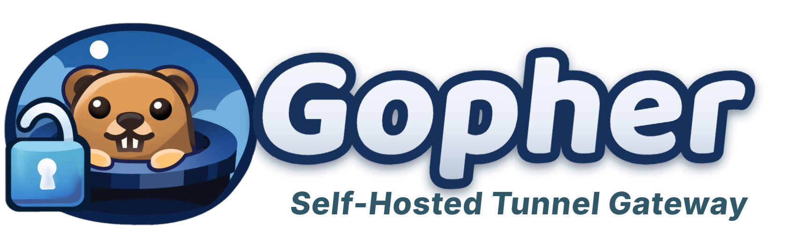

<p align="left">
  
</p>

**A self-hosted edge platform with built-in tunneling.** One Go binary on a $5 VPS gives you what Cloudflare gives you — TLS termination, automatic HTTPS, hidden origin IPs, and request filtering at the edge — except the edge is yours end-to-end. No third party in your TLS perimeter, no SaaS deciding what your service is allowed to do.

The built-in tunnel is the unlock: **any device with outbound internet becomes publicly reachable.** A Raspberry Pi in your closet, a laptop on coffee-shop wifi, a server with no public IP — no port forwarding, no NAT traversal, no static IP. And because you own the edge, you own every decision made there: routing, auth, rate limiting, request filtering.

In short, it's a **public router for your private services** — the same idea as port forwarding, just on a VPS instead of your home router. That's what makes it work even where forwarding can't: behind CGNAT, locked-down campus/corporate networks, or an ISP that blocks inbound ports.

**Example:**
```
photos.yourdomain.com → Immich on home NAS (192.168.1.50:2283)
lab.yourdomain.com    → Jupyter on university server (no public IP)
vault.yourdomain.com  → Bitwarden on Raspberry Pi (behind NAT)
```

---

## Table of Contents

- [Installation](#installation)
- [Setup Workflow](#setup-workflow)
- [Uninstall](#uninstall)
- [How It Works](#how-it-works)
- [Architecture](#architecture)
- [Security and Edge Filtering](#security-and-edge-filtering)
- [Known Limitations](#known-limitations)
- [Use Cases](#use-cases)
- [Comparison](#comparison)
- [Firewall Setup](#firewall-setup)
- [VPS Recommendations](#vps-recommendations)
- [Built on Caddy and rathole](#built-on-caddy-and-rathole)
- [Contributing](#contributing)

---

## Installation

> **📺 Prefer to watch?** [**12-minute video install guide**](https://www.youtube.com/watch?v=KYpr61Ak9FE) — a full walkthrough from VPS to first tunnel.

Gopher ships as a single self-contained binary for Linux. No runtime dependencies — Caddy and rathole are embedded in the binary and run as child processes that Gopher supervises.

### Requirements & support matrix

**Edge — the VPS Gopher runs on:**
- A domain with a wildcard DNS A record pointing at the VPS: `*.yourdomain.com → <VPS IP>`
- Ports **80, 443, and 2333** reachable from the internet (and 22 for your own SSH access; the dashboard starts on 4321)
- `systemd`, `iptables`, and root/`sudo` for install and firewall management; `apt` for the optional fail2ban feature

**Origin — each machine you expose:**
- Linux, with outbound network access to the VPS (no inbound ports or port-forwarding needed)
- `sudo` — required by the bootstrap/agent install. Minimal images (Proxmox, some containers) often
  ship without it: `apt install sudo`, or run the bootstrap command as `root` with the `sudo` removed.

| | Tier 1 — tested every release | Best effort — built, not verified | Unsupported in v0.1.0 |
|---|---|---|---|
| **Edge** | Ubuntu 22.04/24.04 LTS, Debian 12 — amd64, arm64 | Debian 13, other apt-family distros | RHEL-family, Alpine, Arch, non-systemd distros, macOS, Windows |
| **Origin agent** | same distros — amd64, arm64 | armv7 (32-bit ARM) | same |

Other distros may well work — they're just not part of the release test matrix yet.

### Download

**Quick install (latest stable):**
```bash
curl -fsSL https://raw.githubusercontent.com/smalex-z/gopher/main/scripts/install.sh | bash
```

The installer verifies the binary against the release's published SHA-256 checksums before installing.
To pin an exact version (e.g. for a release candidate):
```bash
curl -fsSL https://raw.githubusercontent.com/smalex-z/gopher/main/scripts/install.sh | bash -s -- --version v0.1.0
# or: GOPHER_VERSION=v0.1.0 curl -fsSL ... | bash
```

**Pre-releases** (newer features, may be unstable):
```bash
curl -fsSL https://raw.githubusercontent.com/smalex-z/gopher/main/scripts/install.sh | bash -s -- --prerelease
```

Or

**Manual download:**
```bash
# Check releases page for latest version
wget https://github.com/smalex-z/gopher/releases/latest/download/gopher-linux-amd64
chmod +x gopher-linux-amd64
sudo mv gopher-linux-amd64 /usr/local/bin/gopher
```

Verify your download against `SHA256SUMS.txt` on the [releases page](https://github.com/smalex-z/gopher/releases).

Or

**Build from source** (for development, auditing, or unsupported architectures):
```bash
git clone https://github.com/smalex-z/gopher.git
cd gopher
./scripts/build.sh          # builds the embedded frontend + agent, then the binary
sudo ./gopher install
```
Requires Go and Node 18+ (the build fetches the pinned Go toolchain automatically). The result is a
single self-contained `./gopher` binary, identical to the release artifact.

### Run

```bash
# Start the web UI (listens on :4321)
./gopher

# Install as a systemd service (runs on boot, survives reboots)
sudo ./gopher install

# Check what you're running (version + embedded component versions)
gopher version

# Service management
sudo systemctl status gopher
sudo systemctl restart gopher

# Uninstall
sudo ./gopher uninstall
```

On first start, visit `http://<your-vps-ip>:4321` and complete the setup wizard:

1. **Password** — set your admin password
2. **Local services** — domain + DNS preflight, then configure the embedded Caddy and rathole
3. **SSH key** — generate or upload a key pair used for optional SSH access to bootstrapped machines
4. **fail2ban** — install brute-force protection for the dashboard login (or skip it)
5. **Firewall** — choose how network rules are managed (Gopher-managed is recommended; runs last because the takeover locks down the dashboard port and hands you off to `router.<yourdomain>`)

---

## Setup Workflow

After the wizard, you're at the main dashboard:

**1. Add Machines (Machines tab)**
- Click **Bootstrap New Machine**
- Copy the one-liner and run it on any machine you want to expose
- It installs the rathole tunnel client plus the `gopher-agent` — the control channel Gopher uses to
  manage the machine (config pushes, health streaming, self-update) over the tunnel itself

**2. Create Tunnels (Tunnels tab)**
- Select a machine, enter a subdomain (e.g. `photos`) and the local port (e.g. `2283`)
- Click **Create Tunnel**
- The tunnel shows **provisioning** while the edge applies routing and obtains the TLS certificate —
  usually under a minute — then `https://photos.yourdomain.com` is live with automatic HTTPS

Gopher supports **HTTP, raw TCP, and UDP** tunnels.

---

## Uninstall

Run this on the **edge** (the VPS where you ran `gopher`):

```bash
sudo gopher uninstall
```

It tears down the whole deployment, in order:

1. **Connected origins first** — while the tunnels are still up, it uninstalls the `gopher-agent` and
   tunnel client on every reachable machine (the edge is your path to NAT'd boxes, so this happens
   before the edge goes away). Machines that are **offline** can't be reached and are reported as
   orphans to clean up by hand (below).
2. **The edge itself** — stops and removes the Gopher service, then prompts to either **strip just
   Gopher's managed entries** from Caddy and rathole (keeping your own config, with a `.gopher-backup`)
   or **remove them entirely**, and removes the sudoers entry and the `gopher-jump` user.

**Your data (database, certs, state) is kept by default** — you're prompted before it's deleted, so an
uninstall-to-reinstall keeps your setup. Flags:

- `--keep-data` — always preserve the data directory
- `--keep-origins` — leave the origin machines installed (only remove the edge)
- `--skip-prompts` — remove everything (data + origins included) non-interactively

> To remove a **single machine** without uninstalling everything, just delete it on the dashboard's
> **Machines** tab — Gopher tears it down on the box for you.

### Orphaned origins

A machine that was **offline** when you uninstalled the edge keeps its agent + tunnel client installed
(it just can't reach the now-gone edge). Clean it up directly on the box:
```bash
sudo gopher-uninstall                          # full removal
sudo gopher-uninstall --remove-tunnel  <ID>    # remove just one tunnel
sudo gopher-uninstall --remove-machine <ID>    # remove just one machine's SSH entry
```
Full removal stops and deletes `gopher-agent` and `rathole-client` (services, binaries, `/etc/rathole`,
`/etc/gopher-agent`) and the `gopher` user.

(The helper lives at `/usr/local/bin/gopher-uninstall` — use the full path if your shell can't find it.)

---

## How It Works

**Setup:** Run Gopher on a public VPS. Point `*.yourdomain.com` DNS to it.

**Bootstrap machines:** Run a one-liner on any private machine to install the tunnel client + agent and establish an outbound tunnel to your VPS.

**Create tunnels:** In Gopher's web UI, map subdomains to services: `photos.yourdomain.com` → `machine-name:2283`

**Traffic flow:**
```
User visits photos.yourdomain.com
  ↓
DNS resolves to your VPS IP
  ↓
Caddy terminates TLS on VPS
  ↓
Gopher routes by subdomain
  ↓
rathole tunnel forwards to private machine
  ↓
Service responds back through tunnel
```

Key advantage: Machines connect outbound to the VPS, bypassing NAT and firewalls. The VPS routes incoming internet traffic back through those established tunnels. Your origin IPs are never exposed.

### Encryption model

Visitor traffic is encrypted (HTTPS) to the edge. The edge **terminates TLS** to perform routing, filtering, and bot detection, then **re-encrypts** the traffic via rathole's Noise transport for the hop to your origin. **No plaintext ever traverses the public internet** — but because the edge inspects requests, it holds the TLS keys by design. That's the deliberate trade-off for edge filtering: terminating at the edge is what makes bot detection possible (you can't filter traffic you've chosen not to decrypt). Since the edge is *your* VPS, no third party sees your traffic at any point.

> This is **not** TLS passthrough / true end-to-end encryption to the origin — the edge decrypts. If you need an edge that never sees plaintext, passthrough is the alternative, but it forecloses edge filtering.

---

## Architecture

Gopher is a **self-hosted edge server** that sits between the internet and your private services:

```
Internet → Gopher VPS (your edge) → Private networks (your origins)
```

What makes it an edge server:

- DNS points to Gopher, not your origins
- TLS terminates at Gopher (via Caddy)
- Origin IPs never exposed to the internet
- All traffic flows through Gopher
- Full control over routing and security

Components managed by Gopher:

- **Caddy** — Automatic HTTPS + reverse proxy
- **rathole** — Secure tunnel client/server
- **gopher-agent** — control channel on each origin (config pushes, health, self-update), spoken over gRPC through the tunnel itself
- **Web UI** — Tunnel and machine management

Caddy and rathole are **bundled into the single `gopher` binary** (`go:embed`) and
extracted + run as **child processes that Gopher supervises** — no separate apt
package, no downloads at install, no extra systemd units. The whole edge lives
under `/etc/gopher` (config) and `/var/lib/gopher` (state + certs): one artifact
to install, two directories to back up.

Similar to Cloudflare, but:

- ✅ You own the infrastructure
- ✅ No vendor lock-in
- ✅ No traffic limits or file size caps
- ✅ Support for TCP/UDP (not just HTTP)
- ✅ Full privacy (your traffic never touches third parties)

```
gopher/
├── cmd/
│   ├── server/                     # Entry point; embeds frontend, caddy, rathole, agents
│   └── agent/                      # gopher-agent (runs on each origin)
├── frontend/                       # React + TypeScript + Tailwind
│   └── src/
│       ├── pages/                  # Dashboard, Machines, Tunnels, Server, Setup
│       └── components/             # UI components
├── internal/
│   ├── api/                        # Chi router + HTTP handlers
│   ├── agentpb/                    # gRPC contract between edge and gopher-agent
│   ├── config/                     # Caddyfile + rathole TOML generation
│   ├── db/                         # SQLite (GORM) models + migrations
│   ├── embedbin/ + supervisor/     # Embedded caddy/rathole extraction + child-process supervision
│   ├── service/                    # Business logic (install, tunnels, firewall, …)
│   └── ssh/                        # SSH access to machines (jumpbox keys, fallback pushes)
└── scripts/
    ├── build.sh                    # Build frontend + agents, then Go binary
    └── dev.sh                      # Dev mode with hot reload
```

**Backend:** Go 1.25, Chi router, GORM + glebarez/sqlite (pure-Go, no CGO), gRPC (agent control plane)

**Frontend:** React 18 + TypeScript, Vite, Tailwind CSS — embedded in the binary via `//go:embed`

**Infrastructure (managed by Gopher):** [Caddy 2](https://caddyserver.com/) for HTTPS + routing, [rathole](https://github.com/rathole-org/rathole) for tunneling

---

## Security and Edge Filtering

Because Gopher terminates TLS at the edge (see [Encryption model](#encryption-model)), it can
inspect and filter requests **before they ever reach your origin** — the thing a plain tunnel can't
do. This is what sets it apart from a raw ngrok/Cloudflare-Tunnel pipe.

**Dashboard 2FA (TOTP).** Protect the admin dashboard with time-based one-time passwords — QR
enrollment, multiple devices, and one-time backup codes.

**fail2ban integration.** Gopher writes and manages a fail2ban jail that bans IPs after repeated
failed dashboard logins (configurable retry / find-time / ban-time, plus an allowlist) and surfaces
jail status in the dashboard.

**DNS preflight.** The setup wizard runs a battery of DNS checks before you go live — proving the
wildcard record actually resolves to *your* VPS (not a registrar parking page), checking propagation
across public resolvers, and flagging CAA records that would block certificate issuance — so DNS
problems surface during setup instead of after.

**Firewall management.** Gopher can manage iptables for you — a dedicated chain with tunnel ports
opened and closed automatically as tunnels come and go (see [Firewall Setup](#firewall-setup)).

**Bot detection** *(experimental)*. Opt-in per HTTP tunnel: a JavaScript **proof-of-work challenge**
(~1–3s of browser work) in front of your service, with an HMAC-signed session cookie so real
visitors aren't re-challenged, and JSON responses for API clients. It filters the scrapers and
port-scanners that crawl for exposed services. It is **best-effort friction, not a security
boundary** — see [Known Limitations](#known-limitations).

**Password-gated tunnels** *(experimental)*. Opt-in per HTTP tunnel: a shared-password login page in
front of the service (separate from the dashboard login), with session TTL and an IP allowlist for
trusted networks. Handy for sharing a service with a few people without setting up real auth.

---

## Known Limitations

Honest list of the current trade-offs — each has a tracking issue and a plan:

- **Gopher assumes a dedicated VPS.** The service user holds broad `NOPASSWD` sudo rights (it
  manages iptables, systemd, and system packages for you). Run it on its own box, not a shared
  server. Narrowing these grants is planned.
- **Secrets are stored unencrypted in SQLite.** TOTP secrets and SSH private keys live in
  `gopher.db` in plaintext — so **treat database backups as secrets**. At-rest encryption is planned.
- **The bot challenge is friction, not a boundary.** Challenges aren't server-nonced yet, so a
  determined client can replay solutions. It reliably filters non-JS crawlers; it won't stop a
  targeted attacker. Marked *experimental* in the UI.
- **CSRF posture.** Session cookies use `SameSite=Lax` and cross-origin credentialed requests are
  rejected; remaining exposure is limited to top-level-navigation GETs, whose responses can't be
  read cross-origin. Per-request CSRF tokens are planned.
- **Linux only.** Edge and origins. macOS/Windows origin support is on the roadmap.

---

## Use Cases

**Homelab:**
```
photos.home.com   → Jellyfin media server
vault.home.com    → Bitwarden password manager
files.home.com    → Nextcloud file sync
monitor.home.com  → Grafana dashboards
```

**Research Lab:**
```
jupyter.lab.edu   → Jupyter notebook server
vnc1.lab.edu      → VNC to lab workstation
data.lab.edu      → Dataset browser
```

**Multi-site:**
```
nas.example.com      → Home NAS (Maryland)
jupyter.example.com  → Lab server (UCLA)
media.example.com    → Friend's shared Plex
```

---

## Comparison

Most tools here are *one half* of the stack: ngrok and Tailscale are tunnels with no programmable
edge; Caddy and Traefik are edges that can't reach behind NAT. Gopher is the combination — a
tunnel **and** an edge you own — the category Cloudflare productized, except self-hosted, so no third
party ever sits in front of your services.

|  | Gopher | ngrok | Cloudflare Tunnel | Tailscale Funnel | Port Forwarding |
|---|--------|-------|-------------------|------------------|-----------------|
| **Self-hosted** | ✅ | ❌ | ❌ | ❌ | N/A |
| **Who can read your requests** | ✅ Only you | ❌ ngrok | ❌ Cloudflare | ✅ Only you | ✅ Only you |
| **Edge request filtering** (bot detection) | ✅ | 💰 Paid | ✅ | ❌ | ❌ |
| **Multi-region routing** | ✅ | 💰 Paid | ✅ | ⚠️ Limited | ❌ |
| **Origin IP hidden** | ✅ | ✅ | ✅ | ✅ | ❌ Exposes home IP |
| **Unmetered bandwidth** | ✅ | ❌ Metered | ✅ | ⚠️ Relay-limited | ✅ |
| **Upload size cap** | ✅ None | ✅ None | ❌ 100MB (free) | ✅ None | ✅ None |
| **Custom domain** | ✅ | 💰 Paid only | ⚠️ CF DNS required | ❌ `*.ts.net` only | ✅ |
| **Any DNS registrar** | ✅ | ✅ | ❌ Must use CF DNS | ❌ Tailscale subdomain | ✅ |
| **Permanent URLs** | ✅ | ❌ Ephemeral (free) | ✅ | ✅ | ✅ |
| **Tunnel count** | ✅ Unlimited | ❌ 1 (free) | ✅ Unlimited | ✅ Unlimited | ✅ Unlimited |
| **Protocol support** | HTTP / TCP / UDP | HTTP / TCP | HTTP/HTTPS** | HTTPS only*** | All |
| **Works behind NAT/CGNAT** | ✅ | ✅ | ✅ | ✅ | ❌ |
| **Automatic HTTPS** | ✅ | ✅ | ✅ | ✅ | ❌ Manual |
| **No vendor lock-in** | ✅ | ❌ | ❌ | ❌ | ✅ |

\* Free with significant limitations  
\*\* Cloudflare Tunnel serves HTTP/HTTPS to anonymous visitors; raw TCP needs Spectrum (Pro+), UDP needs Enterprise  
\*\*\* Tailscale Funnel is HTTPS-only on port 443; no TCP/UDP, no raw port exposure  
Cloudflare and ngrok terminate your TLS on their servers, so they can read your requests.

---

## Firewall Setup

### OS-level firewall

Gopher can manage iptables rules automatically. During the setup wizard, choose **Gopher-managed** firewall mode and Gopher will:

- Create a dedicated `GOPHER_TUNNELS` iptables chain
- Keep ports 22, 80, 443, and 2333 permanently open
- Open the dashboard port (default 4321) — or restrict it to localhost if Caddy is configured
- Automatically open/close tunnel ports as you add or remove tunnels

If you prefer to manage firewall rules yourself, choose **Manual** mode and open the required ports yourself. Each tunnel you create gets its own port, assigned automatically from 1024 up (skipping any port already in use) — Gopher shows the assigned port when you create one.

### Cloud-level firewall / security groups

Most cloud providers have a firewall that sits in front of the VM and blocks traffic before it ever reaches the OS. You need to open ports there as well — Gopher cannot manage these.

**Oracle Cloud (OCI)** — the most common gotcha, since the default security list blocks almost everything:

1. Go to **Networking → Virtual Cloud Networks → your VCN → Security Lists**
2. Edit the **Default Security List** (or whichever is attached to your subnet)
3. Add ingress rules for TCP ports 80, 443, and 2333 from source `0.0.0.0/0`
4. Port 22 is usually already open

Alternatively, use a **Network Security Group** attached to your instance instead of the security list.

**AWS EC2:**

1. Go to **EC2 → Instances → your instance → Security**
2. Click the security group link
3. Edit **Inbound rules** → add TCP 80, 443, 2333 from `0.0.0.0/0`

**Hetzner:**

1. Go to **Firewall** in the Cloud Console
2. Add inbound rules for TCP 80, 443, 2333
3. Apply the firewall to your server

**DigitalOcean:**

1. Go to **Networking → Firewalls**
2. Create or edit a firewall, add TCP 80, 443, 2333 inbound
3. Apply it to your droplet

---

## VPS Recommendations

**Tested providers:**
- **Oracle Cloud Free Tier** — 4 vCPU ARM, 24 GB RAM, 4 Gbps — best free option for Gopher
- **Hetzner** — ~€4/month — reliable and cheap
- **DigitalOcean / Vultr** — $6/month droplet works well
- **AWS EC2** — t2.micro is free tier eligible but networking is slow (~0.05 Gbps)

**Minimum:** 1 vCPU, 512 MB RAM handles 10+ tunnels comfortably.

---

## Built on Caddy and rathole

Gopher would not exist without two excellent open-source projects:

**[Caddy](https://caddyserver.com/)** handles all HTTPS termination and subdomain routing on the VPS. It automatically provisions and renews TLS certificates via Let's Encrypt, with zero configuration required from the user. Gopher generates and manages the Caddyfile for you, but Caddy is doing the actual reverse proxying.

**[rathole](https://github.com/rathole-org/rathole)** is the tunnel engine. It's a Rust-based, extremely lightweight TCP/UDP tunnel that machines use to punch through NAT and firewalls by maintaining a persistent outbound connection to the VPS. Gopher manages the rathole server config and deploys rathole client configs to each machine — but rathole is what makes the tunnels actually work.

If you find Gopher useful, please consider starring those projects too.

---

## Contributing

Issues and PRs welcome. See [open issues](https://github.com/smalex-z/gopher/issues).

Areas that would help most:
- Testing on different distros and VPS providers
- Bug reports with reproduction steps

## License

Apache License 2.0 — see [LICENSE](LICENSE) and [NOTICE](NOTICE)

## Acknowledgments

Gopher is a thin management layer on top of two great projects: [Caddy](https://caddyserver.com/) by Matt Holt and the team, and [rathole](https://github.com/rathole-org/rathole) (originally by rapiz1). Without them there is no Gopher.
